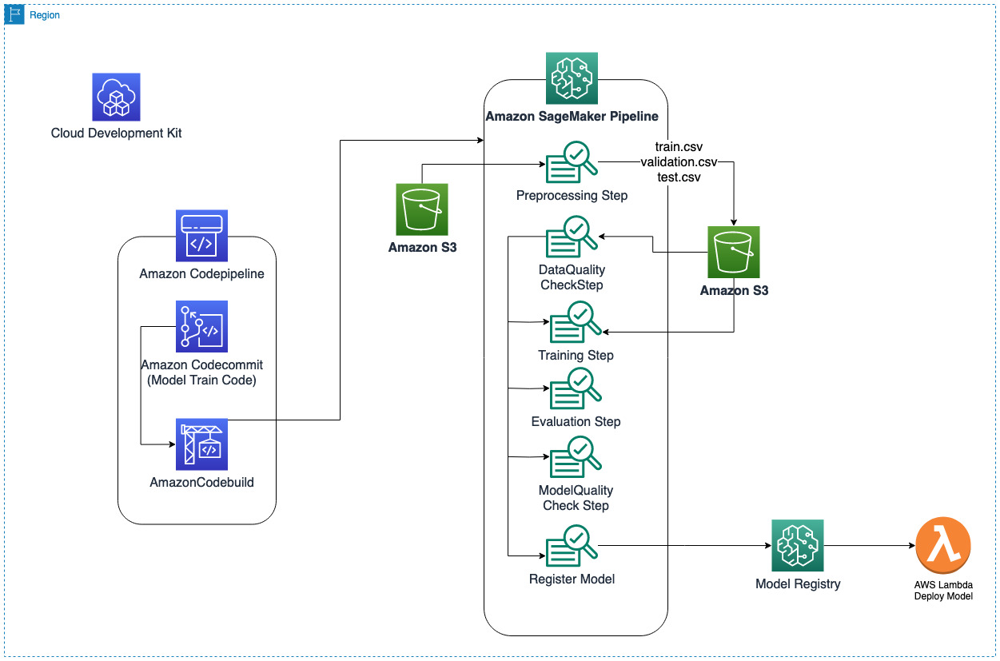
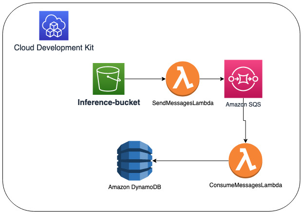
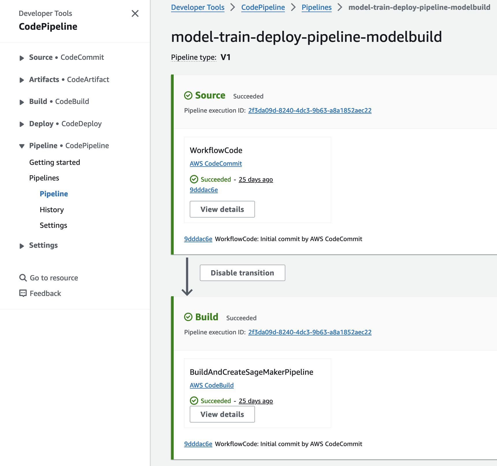
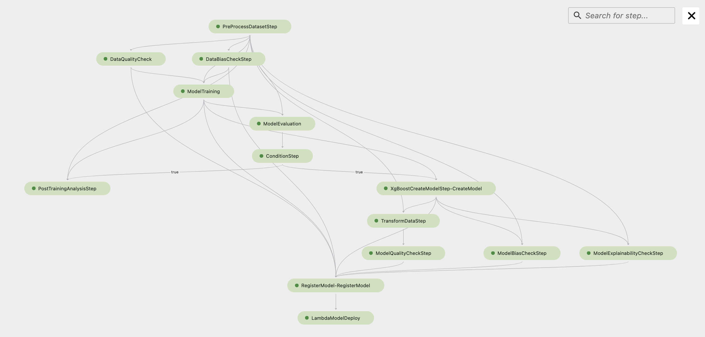
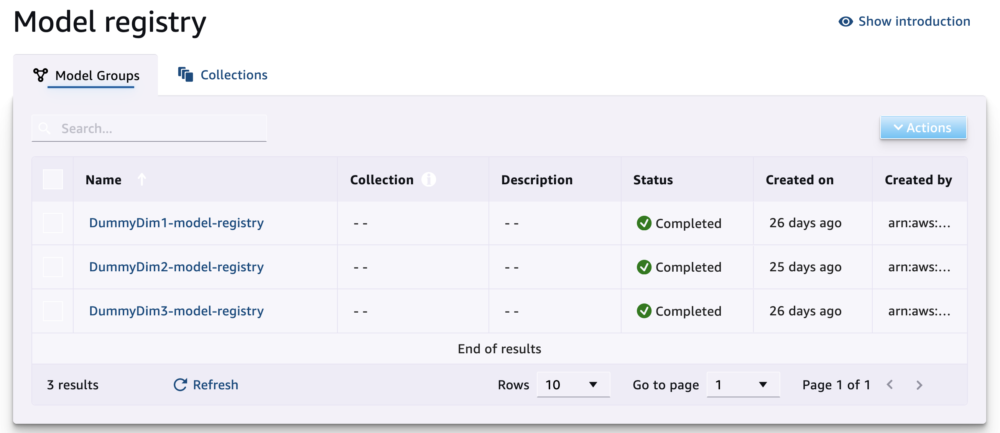
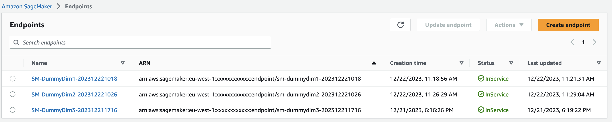

# Deploy and Manage 100x models using Amazon SageMaker Pipelines

## Overview

This GitHub repository showcases the implementation of a comprehensive end-to-end MLOps pipeline using Amazon SageMaker pipelines to deploy and manage 100x machine learning models. The pipeline covers data pre-processing, model training/re-training, hyperparameter tuning, data quality check,model quality check, model registry, and model deployment. Automation of the MLOps pipeline is achieved through Continuous Integration and Continuous Deployment (CI/CD). Machine learning model for this sample code is SageMaker built-in XGBoost algorithm.

## CDK Stacks

The Cloud Development Kit (CDK) is utilized to define four stacks:

1. **SM StudioSetup Stack**: Launches the SageMaker studio domain notebook with enabled SageMaker projects.
2. **SM Pipeline Stack**: Creates a code build pipeline responsible for creating and updating the SageMaker pipeline to orchastrate ML-ops. This stack defines the workflow and dependencies for building and deploying your machine learning pipeline.
3. **Start SM Pipeline Stack**: Designed to respond to new training data uploaded to the specified S3 bucket. It utilizes a Lambda function to trigger the SageMaker pipeline, ensuring that your machine learning models are updated with the latest data automatically.
4. **Inference Result Stack**: This stack creates necessary resources such as SQS (Simple Queue Service) and Lambda functions to handle the inference results from the SageMaker endpoint.


## Dataset
We use a synthetic telecommunication customer churn dataset as our sample use case. The dataset contains customer phone plan usage, account information and their churn status, whether customer would stay or leave the plan. We use SageMaker's built-in XGBoost algorithm which is suitable for this structured data.  In the enhancement of the churn dataset, a new dimension column has been introduced to accommodate values denoted as DummyDim1 through DummyDimN. This approach allows for the creation and training of 100x different models, with each model associated with a distinct DummyDimension. Each row within this dataset pertains to a specific DummyDimX and will be utilized for the training of a corresponding model X. For instance, if there are X customer profiles, you can train X ML models, each associated with DummyDimension values ranging from DummyDim1 to DummyDimX. Inference dataset if already pre-processed dataset from data preproecessing_step of SageMaker pipeline.

## Architecture 

The architecture relies primarily on Amazon SageMaker Pipeline to deliver an end-to-end MLOps pipeline for building, training, monitoring, and deploying machine learning models. The architecture can be divided into two main components:

1. **SageMaker Pipeline**: Handles data pre-processing, model training/tuning, monitoring, and deployment. It leverages SageMaker Studio Domain as a unified interface for model build and inference. AWS CodePipeline, triggered by an AWS CodeBuild project, automates the creation/updation of the SageMaker pipeline. When new training data is uploaded to the input-bucket, the SageMaker re-training pipeline is executed. The sequential steps include:

    - Pulling new training data from S3
    - Preprocessing data for training
    - Conducting data quality checks
    - Training/tuning the model
    - Performing model quality checks
    - Utilizing the Model Registry to store the model
    - Deploying the model

    Model deployment is managed by a Lambda step, providing flexibility for data scientists to deploy specific models with customized logic. As there are 100x model deployment so  the deployment process is triggered promptly upon the addition of a new model to the model registry instead of manual approval. The LambdaStep is invoked to retrieve the recently added model from the registry and effectuate its deployment on the SageMaker endpoint and the decommissioning of the previous version of the model, ensuring a seamless transition and continuous availability of the latest model version for inference purposes.

2. **Inference**: The real-time inference process is initiated by uploading a sample inference file to the Amazon S3 bucket. Subsequently, an AWS Lambda function is triggered, responsible for fetching all records from the CSV file and dispatching them to an Amazon Simple Queue Service (SQS) queue. The SQS queue, in turn, activates a designated Lambda function, consume_messages_lambda, designed to invoke the SageMaker endpoint. This endpoint executes the necessary machine learning model for inference on the provided data, and the resulting predictions are then stored in an Amazon DynamoDB table for further analysis and retrieval. This end-to-end workflow ensures efficient and scalable real-time inference capabilities by leveraging AWS services for seamless data processing and storage.


## How to setup CDK project!

This repository includes a `project_config.json` file containing the following attributes:

- **MainStackName**: Name of the main stack.
- **SageMakerPipelineName**: Name of the SageMaker pipeline.
- **SageMakerUserProfiles**: Usernames for Sagemaker studio domain (e.g., ["User1", "User2"]).
- **USE_AMT**: Automatic Model Tuning (AMT) flag. If set to "yes", AMT will be employed for each model deployment, selecting the best-performing model. 

```json
{
  "MainStackName": "SMPipelineRootStack",
  "SageMakerPipelineName": "model-train-deploy-pipeline",
  "SageMakerUserProfiles": ["User1", "User2"],
  "USE_AMT": "yes"
}
```

Please refer to this configuration file for and update it as per your usecase.

This project is set up like a standard Python project.  The initialization
process also creates a virtualenv within this project, stored under the `.venv`
directory.  To create the virtualenv it assumes that there is a `python3`
(or `python` for Windows) executable in your path with access to the `venv`
package. If for any reason the automatic creation of the virtualenv fails,
you can create the virtualenv manually.

To manually create a virtualenv on MacOS and Linux:

```
$ python3 -m venv .venv
```

After the init process completes and the virtualenv is created, you can use the following
step to activate your virtualenv.

```
$ source .venv/bin/activate
```

If you are a Windows platform, you would activate the virtualenv like this:

```
% .venv\Scripts\activate.bat
```

Once the virtualenv is activated, you can install the required dependencies.

```
$ pip install -r requirements.txt
```

At this point you can now synthesize the CloudFormation template for this code.

```
$ cdk synth --all
```

Deploy all stacks 

```
$ cdk deploy --all
```

After deploying all stacks, ensure the successful execution of the CodePipeline. On AWS Console, navigate to `Developer Tools -> CodePipeline -> Pipelines -> model-train-deploy-pipeline-modelbuild`. Verify the successful completion of the CodePipeline. If the Build phase fails, attempt to rerun the build phase. 



Move the directories from the `dataset/training-dataset` folder to the `inputbucket` S3 bucket. This will kick off the SageMaker pipeline, initiating three separate executions and deploying three models on the SageMaker endpoint. The process is expected to take approximately 45 minutes, and you can monitor the progress through the SageMaker Studio pipeline UI.



For each dimension in our dataset, a corresponding model registry will be created. In our current demonstration, where we have three dimensions, three model registries will be generated. Each model registry will encompass all the models associated with its respective dimension, ensuring a dedicated registry for each dimension.



After successfully executing all pipelines and deploying models on the SageMaker endpoint, copy the files from `dataset/inference-dataset` to the `inferencebucket` S3 bucket. Subsequently, the records are read, and the inference results are stored in a DynamoDB table. It's important to note that the inference data has already undergone preprocessing for seamless integration with the endpoint. In a production setting, it is recommended to implement an inference pipeline to preprocess input data consistently with the training data, ensuring alignment between training and production data.



## Useful commands

 * `cdk ls`          list all stacks in the app
 * `cdk synth`       emits the synthesized CloudFormation template
 * `cdk deploy`      deploy this stack to your default AWS account/region
 * `cdk diff`        compare deployed stack with current state
 * `cdk docs`        open CDK documentation

## Security

See [CONTRIBUTING](CONTRIBUTING.md#security-issue-notifications) for more information.

## License

This library is licensed under the MIT-0 License. See the LICENSE file.
